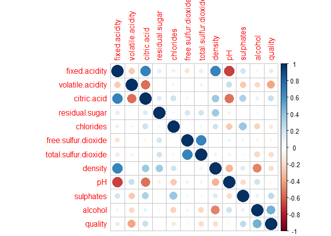

Logistic Regression Tutorial - Reserach Guideline
================
Gunho Lee
2021 3 10

## Welcome to the tutorial\!

This article is written *for those who do not have experiences with
Logistic Regression in R*. If you are familiar with the theory and if
you are looking for more advanced techniques, I do recommend you to
search much nicely explained articles on Medium\!

Furthermore, the article might assist undergraduates who have never
conducted research in their academic life. I have tried to make it very
simple so that those freshmen could grasp a basic idea on it.

I would like to provide a general research approach from the beginning
to the end very briefly. I am going to explain each by each as if I
introduce my own story.

### What is your hobby?

You might wonder why I ask this question. The reason is very simple. I
normally find my research topics based on what I enjoy. Anyway, let’s
get to the point. I am a huge fan of **red wine**. I can’t even count
how much wine I have been consuming since the pandemic.

Hence, I have started to wonder what decides the taste of Red Wine. I am
not an expert, and I have never been to a wine farm either. Let’s say we
are just curious. Nothing more than that. Do you feel why I add these
words here? Because research does not need to be something massive that
would likely affect entire world. If we want to draw a paint, the work
starts with just a small dot. That’s the main point of this article.

Before we dive into real analysis (**meaning we type some codes and
visualize some graphs**), it is very important to fully grasp what we
want to achieve by this whole research project. Although I have used the
word *achieve*, it does not need to be huge as I repeat. What I would
like to learn is very very very simple, that could be formulated as:

#### What is(are) the most significant factor(s) to decide the quality of Red Wine?

It is very simple and concise. Now we have finished, in fact, the most
important step in your quantitative research project. Let’s move on the
next procedure.

## Literature review

What does it mean? Well, let’s be honest, we should not be the one who
tries to add our efforts into this topic. In other words, there should
be sufficient amounts of studies which have already analyzed Red Wine
and its determinant elements. These information would definitely be
helpful to broaden our views and narrow our focus to specific elements.

To save our time, I have collected some of primary data from published
articles and journals.

*Talking about the Quality of wine is not an easy task since everyone
has a different standard to define what is Quality. Not only are the
chemical substances important but also wine laws and rules also play a
crucial role in quality testing. For instance, the grape growing region
is indeed a considerable indicator of producing quality wine around the
world. In the French term, the soil and climate conditions are highly
essential to earn a certified quality wine label. In the context of
chemistry, mouthfeel features could be improved by higher alcohol
concentration, and quinine sulphate also showed a substantial impact on
taste and mouthfeel attributes.*

Alright\! Based on the literature review, we have discovered that
**alcohol** and **sulphates** seem to determine the taste of Red Wine
significantly\! But, **Why is it important?** Because it is highly
crucial for us to have known **this research background before we
conduct an analysis**. In different words, we could test if these
findings match the analysis with our dataset, or will there be a
different outcome?

## Searching Data

Now it is time to find a dataset for the research.

If you have ever tried to search free datasets on Kaggle or other
websites, you might have encountered red & white variants of the
Portuguese “Vinho Verde” wine.
[link](https://www.kaggle.com/uciml/red-wine-quality-cortez-et-al-2009)

## Exploratory Data Analysis (EDA)

Before looking up the overview of the data, let’s first import it\!\!

``` r
wine <- read.table("winequality-red.csv", sep = ";", header = T)
```

As soon as I have imported data, the next thing I would do is to check
how the data looks like. Normally I use these cool and handy functions:
*“head”* *“str”* *“summary”*

``` r
library(knitr)
kable(head(wine))
```

| fixed.acidity | volatile.acidity | citric.acid | residual.sugar | chlorides | free.sulfur.dioxide | total.sulfur.dioxide | density |   pH | sulphates | alcohol | quality |
| ------------: | ---------------: | ----------: | -------------: | --------: | ------------------: | -------------------: | ------: | ---: | --------: | ------: | ------: |
|           7.4 |             0.70 |        0.00 |            1.9 |     0.076 |                  11 |                   34 |  0.9978 | 3.51 |      0.56 |     9.4 |       5 |
|           7.8 |             0.88 |        0.00 |            2.6 |     0.098 |                  25 |                   67 |  0.9968 | 3.20 |      0.68 |     9.8 |       5 |
|           7.8 |             0.76 |        0.04 |            2.3 |     0.092 |                  15 |                   54 |  0.9970 | 3.26 |      0.65 |     9.8 |       5 |
|          11.2 |             0.28 |        0.56 |            1.9 |     0.075 |                  17 |                   60 |  0.9980 | 3.16 |      0.58 |     9.8 |       6 |
|           7.4 |             0.70 |        0.00 |            1.9 |     0.076 |                  11 |                   34 |  0.9978 | 3.51 |      0.56 |     9.4 |       5 |
|           7.4 |             0.66 |        0.00 |            1.8 |     0.075 |                  13 |                   40 |  0.9978 | 3.51 |      0.56 |     9.4 |       5 |

``` r
str(wine)
```

    ## 'data.frame':    1599 obs. of  12 variables:
    ##  $ fixed.acidity       : num  7.4 7.8 7.8 11.2 7.4 7.4 7.9 7.3 7.8 7.5 ...
    ##  $ volatile.acidity    : num  0.7 0.88 0.76 0.28 0.7 0.66 0.6 0.65 0.58 0.5 ...
    ##  $ citric.acid         : num  0 0 0.04 0.56 0 0 0.06 0 0.02 0.36 ...
    ##  $ residual.sugar      : num  1.9 2.6 2.3 1.9 1.9 1.8 1.6 1.2 2 6.1 ...
    ##  $ chlorides           : num  0.076 0.098 0.092 0.075 0.076 0.075 0.069 0.065 0.073 0.071 ...
    ##  $ free.sulfur.dioxide : num  11 25 15 17 11 13 15 15 9 17 ...
    ##  $ total.sulfur.dioxide: num  34 67 54 60 34 40 59 21 18 102 ...
    ##  $ density             : num  0.998 0.997 0.997 0.998 0.998 ...
    ##  $ pH                  : num  3.51 3.2 3.26 3.16 3.51 3.51 3.3 3.39 3.36 3.35 ...
    ##  $ sulphates           : num  0.56 0.68 0.65 0.58 0.56 0.56 0.46 0.47 0.57 0.8 ...
    ##  $ alcohol             : num  9.4 9.8 9.8 9.8 9.4 9.4 9.4 10 9.5 10.5 ...
    ##  $ quality             : int  5 5 5 6 5 5 5 7 7 5 ...

``` r
kable(summary(wine))
```

|  | fixed.acidity | volatile.acidity | citric.acid   | residual.sugar | chlorides       | free.sulfur.dioxide | total.sulfur.dioxide | density        | pH            | sulphates      | alcohol       | quality       |
| :- | :------------ | :--------------- | :------------ | :------------- | :-------------- | :------------------ | :------------------- | :------------- | :------------ | :------------- | :------------ | :------------ |
|  | Min. : 4.60   | Min. :0.1200     | Min. :0.000   | Min. : 0.900   | Min. :0.01200   | Min. : 1.00         | Min. : 6.00          | Min. :0.9901   | Min. :2.740   | Min. :0.3300   | Min. : 8.40   | Min. :3.000   |
|  | 1st Qu.: 7.10 | 1st Qu.:0.3900   | 1st Qu.:0.090 | 1st Qu.: 1.900 | 1st Qu.:0.07000 | 1st Qu.: 7.00       | 1st Qu.: 22.00       | 1st Qu.:0.9956 | 1st Qu.:3.210 | 1st Qu.:0.5500 | 1st Qu.: 9.50 | 1st Qu.:5.000 |
|  | Median : 7.90 | Median :0.5200   | Median :0.260 | Median : 2.200 | Median :0.07900 | Median :14.00       | Median : 38.00       | Median :0.9968 | Median :3.310 | Median :0.6200 | Median :10.20 | Median :6.000 |
|  | Mean : 8.32   | Mean :0.5278     | Mean :0.271   | Mean : 2.539   | Mean :0.08747   | Mean :15.87         | Mean : 46.47         | Mean :0.9967   | Mean :3.311   | Mean :0.6581   | Mean :10.42   | Mean :5.636   |
|  | 3rd Qu.: 9.20 | 3rd Qu.:0.6400   | 3rd Qu.:0.420 | 3rd Qu.: 2.600 | 3rd Qu.:0.09000 | 3rd Qu.:21.00       | 3rd Qu.: 62.00       | 3rd Qu.:0.9978 | 3rd Qu.:3.400 | 3rd Qu.:0.7300 | 3rd Qu.:11.10 | 3rd Qu.:6.000 |
|  | Max. :15.90   | Max. :1.5800     | Max. :1.000   | Max. :15.500   | Max. :0.61100   | Max. :72.00         | Max. :289.00         | Max. :1.0037   | Max. :4.010   | Max. :2.0000   | Max. :14.90   | Max. :8.000   |

They have given us a nicely sorted overview of the dataset. Now we are
interested in *quality* variable since it would anyway be the dependent
variable\! In other words, we would like to have a look at how to
predict *quality* given the other variables\!

``` r
library(corrplot)
```

    ## Warning: package 'corrplot' was built under R version 4.0.4

    ## corrplot 0.84 loaded

``` r
# we obtain the correlation scores of the variables
wine_cor <- cor(wine)
# and we visualise
corrplot(wine_cor)
```

<!-- -->

``` r
# it is also possible to plot with numbers
corrplot(wine_cor, method="number")
```

<!-- -->

These codes would be useful to visualise the correlations between the
variables in case you want to clarify.

Now, let’s decide what sort of statistical analysis we will (and can)
use for further statistical analysis. *What would you prefer? What
method would be most applicable to the case?*

Some of you might say **multiple regression** because we might want to
*predict* the score of quality?

Well, it is not actually a good idea. Let’s check *WHY*

``` r
library(ggplot2)
ggplot(wine, aes(x=quality)) +
  geom_histogram()
```

    ## `stat_bin()` using `bins = 30`. Pick better value with `binwidth`.

<!-- --> Do you get the
reason? There are only 6 possible outputs in *quality*, meaning it is
not a proper *dependent variable* for multiple regression. Ideally, it
should be more than 20 values at least. Then what should we do?

## Logistic Regression

Logistic Regression can be an alternative that we can consider, and it
is what we are going to use for this research. I am not going to explain
the details of Logistic Regression, but the important thing to know is
that it is used for a binary case, which we will create by data
manipulation.

Remember\! Our dataset does not have any binary variables now\! How can
we convert the current *quality* variable to the binary variable?

## Data Manipulation

You may have realised that it has already taken much time and efforts to
arrive here despite the fact that we have not even applied some
statistical method to the dataset.

Let’s be honest. This is the reason why Data Scientist is being called
*UnSexy* job, nevertheless, we have to enjoy this process since if the
input is trash, the output will be trash as well no matter how fancy
techniques we utilise.

``` r
library(dplyr)
```

    ## 
    ## Attaching package: 'dplyr'

    ## The following objects are masked from 'package:stats':
    ## 
    ##     filter, lag

    ## The following objects are masked from 'package:base':
    ## 
    ##     intersect, setdiff, setequal, union

``` r
binwine <- wine %>%
  mutate(quality = ifelse(quality > 5, "Good", "Bad"))
```

``` r
kable(head(binwine))
```

| fixed.acidity | volatile.acidity | citric.acid | residual.sugar | chlorides | free.sulfur.dioxide | total.sulfur.dioxide | density |   pH | sulphates | alcohol | quality |
| ------------: | ---------------: | ----------: | -------------: | --------: | ------------------: | -------------------: | ------: | ---: | --------: | ------: | :------ |
|           7.4 |             0.70 |        0.00 |            1.9 |     0.076 |                  11 |                   34 |  0.9978 | 3.51 |      0.56 |     9.4 | Bad     |
|           7.8 |             0.88 |        0.00 |            2.6 |     0.098 |                  25 |                   67 |  0.9968 | 3.20 |      0.68 |     9.8 | Bad     |
|           7.8 |             0.76 |        0.04 |            2.3 |     0.092 |                  15 |                   54 |  0.9970 | 3.26 |      0.65 |     9.8 | Bad     |
|          11.2 |             0.28 |        0.56 |            1.9 |     0.075 |                  17 |                   60 |  0.9980 | 3.16 |      0.58 |     9.8 | Good    |
|           7.4 |             0.70 |        0.00 |            1.9 |     0.076 |                  11 |                   34 |  0.9978 | 3.51 |      0.56 |     9.4 | Bad     |
|           7.4 |             0.66 |        0.00 |            1.8 |     0.075 |                  13 |                   40 |  0.9978 | 3.51 |      0.56 |     9.4 | Bad     |

``` r
binwine$quality <- as.factor(binwine$quality)
head(binwine)
```

    ##   fixed.acidity volatile.acidity citric.acid residual.sugar chlorides
    ## 1           7.4             0.70        0.00            1.9     0.076
    ## 2           7.8             0.88        0.00            2.6     0.098
    ## 3           7.8             0.76        0.04            2.3     0.092
    ## 4          11.2             0.28        0.56            1.9     0.075
    ## 5           7.4             0.70        0.00            1.9     0.076
    ## 6           7.4             0.66        0.00            1.8     0.075
    ##   free.sulfur.dioxide total.sulfur.dioxide density   pH sulphates alcohol
    ## 1                  11                   34  0.9978 3.51      0.56     9.4
    ## 2                  25                   67  0.9968 3.20      0.68     9.8
    ## 3                  15                   54  0.9970 3.26      0.65     9.8
    ## 4                  17                   60  0.9980 3.16      0.58     9.8
    ## 5                  11                   34  0.9978 3.51      0.56     9.4
    ## 6                  13                   40  0.9978 3.51      0.56     9.4
    ##   quality
    ## 1     Bad
    ## 2     Bad
    ## 3     Bad
    ## 4    Good
    ## 5     Bad
    ## 6     Bad

I’d like to divide the values of *quality* into the two groups:

1.  “BAD”

<!-- end list -->

1)  quality from 3 to 5

<!-- end list -->

2.  “GOOD”

<!-- end list -->

1)  quality from 6 to 8

*Remember you can always set a different criteria*. It depends on your
choice as always.

Excellent\! Now we have the cleaned and correctly manipulated data for
the analysis.

## Logistic Regression

``` r
set.seed(123)
# we appoint 80% of the data as the train set, and 20% for the test set.
train_binwine <- sample(1:nrow(binwine), size=0.8*nrow(binwine), replace=F)
train <- binwine[train_binwine,]
test <- binwine[-train_binwine,]
```

The first thing we need to do is to split the dataset into a train set
and a test set. Let’s check if we have specified the train and the test
set in a correct order.

``` r
str(train)
```

    ## 'data.frame':    1279 obs. of  12 variables:
    ##  $ fixed.acidity       : num  8.8 11 7 10.4 7.6 12 8.2 9.1 7.1 10.4 ...
    ##  $ volatile.acidity    : num  0.52 0.26 0.805 0.64 0.55 0.63 0.38 0.34 0.72 0.43 ...
    ##  $ citric.acid         : num  0.34 0.68 0 0.24 0.21 0.5 0.32 0.42 0 0.5 ...
    ##  $ residual.sugar      : num  2.7 2.55 2.5 2.8 2.2 1.4 2.5 1.8 1.8 2.3 ...
    ##  $ chlorides           : num  0.087 0.085 0.068 0.105 0.071 0.071 0.08 0.058 0.123 0.068 ...
    ##  $ free.sulfur.dioxide : num  24 10 7 29 7 6 24 9 6 13 ...
    ##  $ total.sulfur.dioxide: num  122 25 20 53 28 26 71 18 14 19 ...
    ##  $ density             : num  0.998 0.997 0.997 1 0.996 ...
    ##  $ pH                  : num  3.26 3.18 3.48 3.24 3.28 3.07 3.27 3.18 3.45 3.1 ...
    ##  $ sulphates           : num  0.61 0.61 0.56 0.67 0.55 0.6 0.85 0.55 0.58 0.87 ...
    ##  $ alcohol             : num  9.5 11.8 9.6 9.9 9.7 10.4 11 11.4 9.8 11.4 ...
    ##  $ quality             : Factor w/ 2 levels "Bad","Good": 1 1 1 1 1 1 2 1 1 2 ...

``` r
str(test)
```

    ## 'data.frame':    320 obs. of  12 variables:
    ##  $ fixed.acidity       : num  7.8 7.9 8.9 7.6 7.9 7.6 7.5 7.7 5.6 6.6 ...
    ##  $ volatile.acidity    : num  0.76 0.6 0.62 0.39 0.43 0.41 0.49 0.935 0.31 0.5 ...
    ##  $ citric.acid         : num  0.04 0.06 0.18 0.31 0.21 0.24 0.2 0.43 0.37 0.04 ...
    ##  $ residual.sugar      : num  2.3 1.6 3.8 2.3 1.6 1.8 2.6 2.2 1.4 2.1 ...
    ##  $ chlorides           : num  0.092 0.069 0.176 0.082 0.106 0.08 0.332 0.114 0.074 0.068 ...
    ##  $ free.sulfur.dioxide : num  15 15 52 23 10 4 8 22 12 6 ...
    ##  $ total.sulfur.dioxide: num  54 59 145 71 37 11 14 114 96 14 ...
    ##  $ density             : num  0.997 0.996 0.999 0.998 0.997 ...
    ##  $ pH                  : num  3.26 3.3 3.16 3.52 3.17 3.28 3.21 3.25 3.32 3.39 ...
    ##  $ sulphates           : num  0.65 0.46 0.88 0.65 0.91 0.59 0.9 0.73 0.58 0.64 ...
    ##  $ alcohol             : num  9.8 9.4 9.2 9.7 9.5 9.5 10.5 9.2 9.2 9.4 ...
    ##  $ quality             : Factor w/ 2 levels "Bad","Good": 1 1 1 1 1 1 2 1 1 2 ...

``` r
dim(train)
```

    ## [1] 1279   12

``` r
dim(test)
```

    ## [1] 320  12

Great\! The codes seem to have done their jobs well.

``` r
fit <- glm(quality ~ ., data = train, family= binomial())
summary(fit)
```

    ## 
    ## Call:
    ## glm(formula = quality ~ ., family = binomial(), data = train)
    ## 
    ## Deviance Residuals: 
    ##     Min       1Q   Median       3Q      Max  
    ## -3.4358  -0.8426   0.3218   0.8111   2.2542  
    ## 
    ## Coefficients:
    ##                        Estimate Std. Error z value Pr(>|z|)    
    ## (Intercept)           65.986369  88.733106   0.744   0.4571    
    ## fixed.acidity          0.180907   0.111112   1.628   0.1035    
    ## volatile.acidity      -3.094321   0.546271  -5.664 1.48e-08 ***
    ## citric.acid           -1.206723   0.628152  -1.921   0.0547 .  
    ## residual.sugar         0.018917   0.062721   0.302   0.7629    
    ## chlorides             -3.869010   1.719849  -2.250   0.0245 *  
    ## free.sulfur.dioxide    0.018333   0.009349   1.961   0.0499 *  
    ## total.sulfur.dioxide  -0.015878   0.003194  -4.971 6.67e-07 ***
    ## density              -73.712808  90.600035  -0.814   0.4159    
    ## pH                    -0.521305   0.800215  -0.651   0.5148    
    ## sulphates              2.482451   0.497641   4.988 6.09e-07 ***
    ## alcohol                0.865303   0.116888   7.403 1.33e-13 ***
    ## ---
    ## Signif. codes:  0 '***' 0.001 '**' 0.01 '*' 0.05 '.' 0.1 ' ' 1
    ## 
    ## (Dispersion parameter for binomial family taken to be 1)
    ## 
    ##     Null deviance: 1763.4  on 1278  degrees of freedom
    ## Residual deviance: 1323.6  on 1267  degrees of freedom
    ## AIC: 1347.6
    ## 
    ## Number of Fisher Scoring iterations: 4

We apply *glm* to the *train* set to check the correlations between the
predictors and the dependent variable (*quality*). You may feel confused
with all those weird numbers if you do not have knowledge of statistics,
but it is okay. We are going to focus on the p-values to check *WHICH
FACTORS ARE SIGNIFICANT*.

### WHAT IS THE MEANING OF STATISTICAL SIGNIFICANCE??

It means that if predictor A is significant (if its p-value is
sufficiently low given the confidence level), its effect on the
dependent variable cannot be ignored.

As we have already known from the literature reivew, acidity, sulphates
and alcohol are indeed statistically significant to *quality*. Great\!
Our findings match our primary study.

Now it is time to build a new model with the significant factors only.
(*Note: chlorides and free.sulfur.dioxide show significance too,
therefore it may be better to check the differences in case they are
included. But here I am going to use only more significant variables for
simplicity.*)

``` r
fit <- glm(quality ~ volatile.acidity + total.sulfur.dioxide + sulphates + alcohol, data = train, family= binomial())
```

``` r
probs <- predict(fit, test, type = "response")
probs[1:5]
```

    ##         3         7        15        22        23 
    ## 0.2396665 0.1916808 0.1146150 0.4171445 0.5657297

``` r
pred <- ifelse(probs > 0.5, "Good", "Bad")
pred[1:5]
```

    ##      3      7     15     22     23 
    ##  "Bad"  "Bad"  "Bad"  "Bad" "Good"

``` r
# confusion matrix
cm <- table(pred, test$quality)
```

``` r
# confusion matrix visualization
fourfoldplot(cm, color = c("#ff0000", "#1500ff"),
             conf.level = 0, margin = 1, main = "Confusion Matrix")
```

<!-- -->

The visualization helps us to understand the confusion matrix a little
bit better. We have to keep in mind that our readers will be mostly the
ones who have no knowledge of statistics. Therefore, it is very crucial
to make everything simple so that even children can grasp what we want
to convey.

``` r
# Accuracy test
mean(pred == test$quality)
```

    ## [1] 0.746875

The accuracy test indicates that our model has approximately *74.687%*
accuracy, meaning that our train set matches *74.687%* of the values in
the test set.

In statistical terms, the result between 70 to 80% is considered
**Acceptable**. Of course, we have plenty ways of improving the model in
order to get much higher accuracy, however, this tutorial does not cover
those deeper analysis as mentioned in the beginning.

## Conclusion

We have discovered that some factors in the dataset are indeed
determinant elements to determine the quality of wine. However, as our
accuracy level could be improved, we can say that having the variables
is not enough to exactly pinpoint which wine is considered **Good** or
**Bad**.

Based on our primary research, we can guess there should be differences
between the regions of each wine, and the temperatures of each region,
and so on and on. It would have been better if the dataset had contained
those information too. Let’s say it is the limitation of our research,
which should be addressed in future research.

## Summary

During the tutorial, we have briefly discussed how research can be
conducted from the beginning to the end.

Let me summarise what we have discussed so far.

#### To do list

1.  *Find any research topic within the boundary of your interest
    (music, sports, yoga, whatever)*
2.  *Decide what you would like to learn from the research* and
    *formulate a research question accordingly*
3.  *Find relevant datasets for your research*  
4.  *Conduct literature review to collect primary information*
5.  *Check if your dataset is cleaned well so it can do proper
    analysis*, if not, *do Data manipulation*
6.  *Apply a proper statistical method and interpret the result
    carefully*
7.  *Draw your conclusion and specify limitations and suggestions for
    future research*

I do hope you have earned a small insight from the article. If so, I am
inclined to believe that it will remind you of the basic steps to build
a great research approach in your interests. Thanks for your time on
it\!
